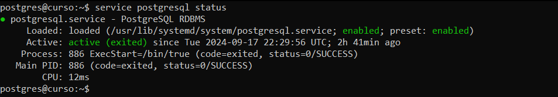
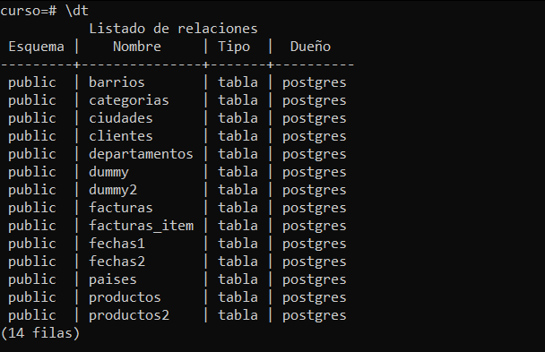

# Práctica 1. Instalación de PostgreSQL en Ubuntu Linux desde respositorio y primeros pasos

## Objetivo de la práctica:

Al finalizar la práctica, serás capaz de:

- Instalar Postgresql en un servidor Ubuntu Linux usando el repositorio oficial.
- Usar la herramienta psql para inspeccionar los objetos del sistema.
- Subir y baja la base de datos.

## Objetivo visual:


## Duración aproximada:
- 30 minutos.

## Instrucciones

### Tarea 1. Instalación de Postgresql en Ubuntu Linux desde repositorio oficial

Paso 1. Actualizar el sistema Ubuntu.

```shell
sudo apt update
```

Paso 2. Instalar paquetes requeridos para descargar los archivos.

```shell
sudo apt install wget ca-certificates
```

Paso 3. Agregar el repositorio APT oficial de PostgreSQL.

```shell
wget -qO - https://www.postgresql.org/media/keys/ACCC4CF8.asc | sudo apt-key add -
sudo sh -c 'echo "deb http://apt.postgresql.org/pub/repos/apt $(lsb_release -cs)-pgdg main" >> /etc/apt/sources.list.d/pgdg.list'
```

Paso 4. Actualizar nuevamente el sistema para que tome el nuevo repositorio.

```shell
sudo apt update
```

Paso 5. Ejecutar el comando de instalación.

```shell
sudo apt install postgresql-14 postgresql-contrib
```

Paso 6. Revisar el estado del servidor.

```shell
sudo service postgresql status
```

Paso 7. Identificar los procesos de postgres que están ejecutándose.

```shell
sudo service postgresql status
```

Paso 8. Bajar el servicio.

```shell
sudo service postgresql stop
```

Paso 9. Subir el servicio.

```shell
sudo service postgresql start
```

Paso 10. Consultar el estado del servicio.

```shell
sudo service postgresql status
```

### Resultado esperado


### Tarea 2. Usar la herramienta psql para explorar los recursos de la base de datos creada.
Paso 1. Conectarse localmente a la base de datos usando psql. 
```shell
sudo sudo su - postgres
psql 
```
Paso 2. Consultar las bases de datos. 
```shell
\l 
```

Paso 3. Pedir ayuda sobre los comandos psql.
```shell
\?
```
Paso 4. Pedir ayuda sobre comandos sql.
```shell
\h
```
Paso 5. Explorar los distintos comandos psql.
```shell
\h
```
### Tarea 3. Instalar la base de datos de ejemplo del curso.

A continuación se instalará la base de datos de prácticas.

Paso 1. Ingresar como usuario postgres.

```shell
sudo su - postgres
```

Paso 2. Crear una base de datos llamada 'curso' con las opciones por defecto.

```shell
createdb curso
```

Paso 3. Ejecutar el siguiente comando:

```shell
psql -d curso < base_datos_curso.sql
```

Paso 4. Ejecutar la utilidad psql y listar las tablas de la base de datos curso.

```shell
psql -d curso
\dt
```

### Resultado esperado:



## [Índice principal](../README.md)

## [Práctica 2. Creación de índices B-tree](../Capítulo2/README.md)
