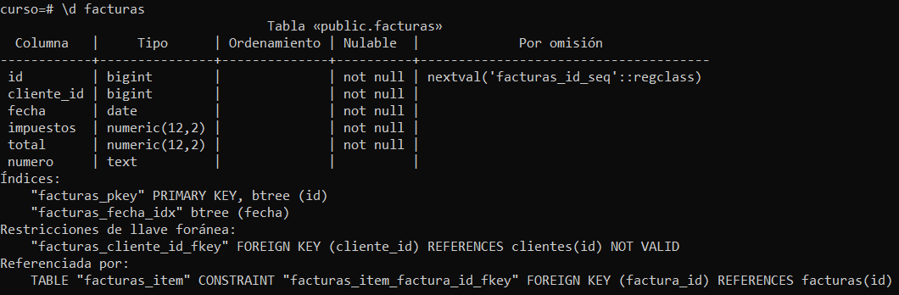
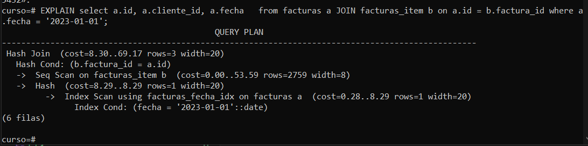

# Práctica 2. Creación de índices B-tree

## Objetivo de la práctica:

Al finalizar la práctica, serás capaz de:

- Crear índices de tipo b-tree. <br>
- Usar el comando explain para conocer el plan de ejecución de un query.

## Objetivo visual:
 


## Duración aproximada:

- 30 minutos.

## Tabla de ayuda:

Comando de creación de índices:

```shell
CREATE INDEX ON tabla(campo);
```

Para las opciones de CREATE INDEX se puede consultar la ayuda con:

```shell
\h CREATE INDEX
```

Para verificar los índices de una tabla se puede usar la opción de psql:

```shell
\d nombre_tabla
```

## Instrucciones 

### Tarea 1. Indexar la tabla facturas con el campo fecha.

Paso 1. Ingresar a la herramienta psql en la base de datos del curso.

```shell
psql -d curso
```

Paso 2. Ejecutar el comando para crear el índice:

```shell
 CREATE INDEX ON facturas(fecha);
```

Paso 3. Consultar la estructura de la tabla para verificar la creación:

```shell
 \d facturas
```

### Resultado esperado:



### Tarea 2. Analizar el plan de ejecución de una sentencia SQL usando EXPLAIN.

Paso 1. Ingresar a la herramienta psql en la base de datos del curso.

```shell
psql -d curso
```

Paso 2. Mostrar el plan de ejecución de la siguiente sentencia SQL:

```shell
EXPLAIN SELECT a.id, a.fecha FROM facturas a JOIN facturas_item b ON a.id = b.factura_id where fecha = '2023-01-01';
```

### Resultado esperado:


## [Índice principal](../README.md)

## [Práctica 1. Instalación de PostgreSQL en Ubuntu Linux](./Capítulo1/README.md)

## [Práctica 3. Manejo de transacciones y MVCC](./Capítulo3/README.md)
