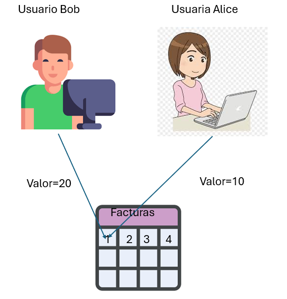
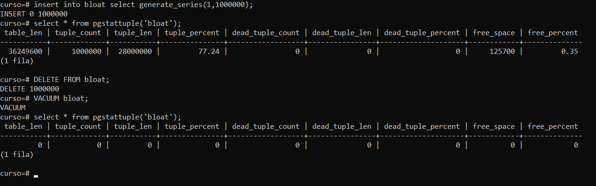

# Práctica 3. Manejo de transacciones y MVCC

## Objetivo de la práctica:

Al finalizar la práctica, serás capaz de:

- Observar el funcionamiento del bloqueo de registros. <br>
- Aplicar el comando VACUUM para eliminar tuplas muertas u obsoletas.

## Objetivo visual:



## Duración aproximada:

- 30 minutos.

## Instrucciones 

### Tarea 1. Simular dos transacciones simultáneas que modifican un mismo registro.

Paso 1.  Crear una sesión psql y establecer el prompt con el nombre "ALICE".

```shell
psql curso 
\set PROMPT1 'ALICE> '
```

Paso 2.  Crear otra sesión o ventana de psql y establecer el prompt con el nombre "BOB".

```shell
psql curso
\set PROMPT1 'BOB> '
```

Paso 3. Crear una tabla llamada mvcc_lab con los siguientes campos: id integer, valor integer.

```shell 
BOB> CREATE TABLE mvcc_lab ( id integer, valor integer);
```

Paso 4. Añadir datos de prueba a la tabla recien creada.

```shell 
BOB> INSERT INTO mvcc_lab SELECT a,a from generate_series(1,10) as a;
```

Paso 5. Iniciar una transacción en la ventana ALICE que actualice el registro con id=1 al valor 10 de la tabla mvcc_lab

```shell 
ALICE> BEGIN;
ALICE> UPDATE mvcc_lab SET valor=10 WHERE id=1;
UPDATE 1
ALICE>
```
Paso 6. Iniciar una transacción en la ventana BOB que actualice el registro con id=1 al valor 20 de la tabla mvcc_lab

```shell 
BOB> BEGIN;
BOB> UPDATE mvcc_lab SET valor=20 WHERE id=1;
_(esperando...)
```

Paso 7. Confirme la transacción de la terminal ALICE y consulte el valor del registro con id = 1

```shell 
ALICE> COMMIT;
ALICE> SELECT valor FROM mvcc_lab WHERE id=1;
 valor
-------
 10
(1 fila)
```

Paso 8. Consulte el valor del registro id=1 en la terminal BOB.

```shell 
BOB> SELECT valor FROM mvcc_lab WHERE id=1;
 valor
-------
 20
(1 fila)
```

Paso 9. Confirme la transacción en la terminal BOB y consulte el valor del registro en la terminal ALICE.

```shell 
UPDATE 1 -- Mensaje cuando ALICE confirmó transaccion
BOB>COMMIT;
ALICE>SELECT valor FROM mvcc_lab WHERE id=1;
 valor
-------
 20
(1 fila)

```

### Tarea 2. Utilizar el comando VACUUM para eliminar las tuplas muertas u obsoletas de una tabla.

Paso 1. En una sesión psql crear una tabla llamada "bloat" con un único campo de nombre id y tipo entero:

```shell 
psql curso
CREATE TABLE bloat ( id integer );
```

Paso 2. Insertar datos de prueba o ficticios.

```shell 
INSERT INTO bloat SELECT generate_series(1,1000000);
```

Paso 3. Instalar la extensión pgstattuple que permite conocer el número de registros borrados.

```shell 
CREATE EXTENSION pgstattuple;
#CREATE EXTENSION
```

Paso 4. Consultar el estado de la tabla "bloat" con la extensión pgstattuple.

```shell 
SELECT * FROM pgstattuple('bloat');
```

Paso 5. Borrar la tabla bloat con el comando `DELETE`.

```shell 
DELETE FROM bloat;
```

Paso 6. Consultar nuevamente el estado de la tabla "bloat" con la extensión pgstattuple.

```shell 
SELECT * FROM pgstattuple('bloat');
```

Paso 7. Aplicar el comando VACUUM a la tabla bloat.

```shell 
VACUUM bloat;
#VACUUM
```

Paso 8. Consultar nuevamente el estado de la tabla "bloat" con la extensión pgstattuple.

```shell 
SELECT * FROM pgstattuple('bloat');
```

### Resultado esperado:



## [Índice principal](../README.md)

## [Práctica 2. Creación de índices B-tree](./Capítulo2/README.md)

## [Práctica 4. Realización de backups lógicos y físicos](./Capítulo4/README.md)
