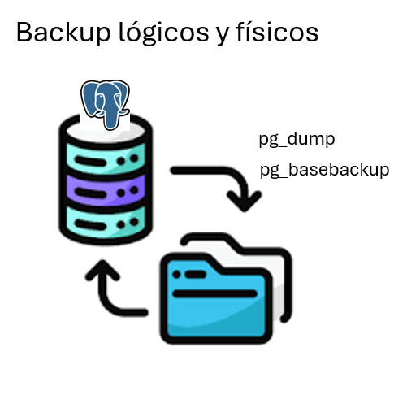
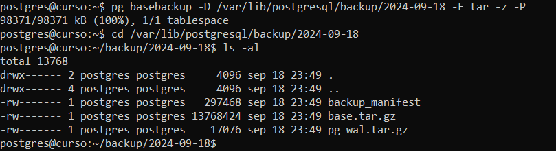

# Realización de backups lógicos y físicos

## Objetivo de la práctica:
Al finalizar la práctica, serás capaz de:
- Realizar un backup lógico usando el comando pg_dump
- Realizar un backup físico usando el comando pg_basebackup

## Objetivo Visual 
Crear un diagrama o imagen que resuma las actividades a realizar, un ejemplo es la siguiente imagen. 



## Duración aproximada:
- 30 minutos.

## Tabla de ayuda:
Uso de pg_basebackup:
pg_basebackup -D /ruta/al/directorio/de/backup -F tar -z -P

Uso de pg_dump:
pg_dump -U usuario -d mi_base_de_datos > backup.sql

## Instrucciones 
<!-- Proporciona pasos detallados sobre cómo configurar y administrar sistemas, implementar soluciones de software, realizar pruebas de seguridad, o cualquier otro escenario práctico relevante para el campo de la tecnología de la información -->
### Tarea 1. Realizar un backup lógico de la base de datos curso.
Paso 1. Crear una sesión con el usuario postgres
```shell
sudo su - postgres
```

Paso 2. Ejecutar el comando pg_dump y comprimir la salida con gzip
```shell
pg_dump curso | gzip > backup.sql.gz
```

### Tarea 2. Realizar un backup físico con pg_basebackup
Paso 1. Crear una sesión con el usuario postgres
```shell
sudo su - postgres
```

Paso 2. Ejecutar el comando pg_basebackup y comprimir la salida con gzip
```shell
pg_basebackup -D /ruta/al/directorio/de/backup -F tar -z -P
```

Paso 3. Revisar los archivos generados
```shell
cd /ruta/al/directorio/de/backup
ls -al
```


### Resultado esperado
En esta sección se debe mostrar el resultado esperado de nuestro laboratorio

