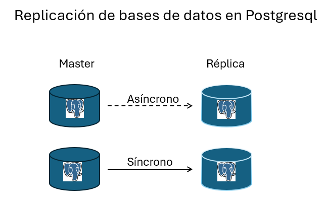
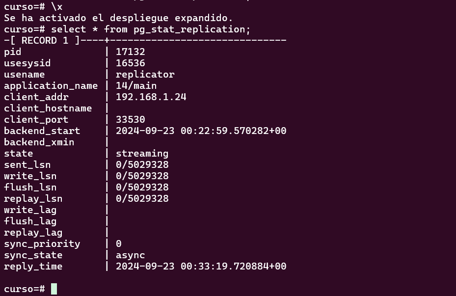

# Práctica 5. Replicación asíncrona y síncrona

## Objetivo de la práctica:

Al finalizar la práctica, serás capaz de:

- Realizar una replicación asíncrona de una instancia de postgresql.
- Realizar una replicación síncrona de una instancia de postgresql.

## Objetivo visual:



## Duración aproximada:

- 30 minutos.

## Instrucciones 

### Tarea 1. Configurar la replicación entre el servidor del curso (primario) con uno nuevo llamado secundario.

Paso 1. Instalar un nuevo servidor virtual en Virtualbox usando la imagen de Ubuntu 24.02

Nombre de host: secundario <br>
IP : <IP_SECUNDARIO>

Paso 2. En el servidor primario, editar postgresql.conf:

```shell
listen_addresses = '*'
wal_level = replica
max_wal_senders = 3
```

Paso 3. En el servidor primario, edite pg_hba.conf para permitir la conexión del secundario.

```shell
host replication all <IP_SECUNDARIO>/32 md5
```

Paso 4. Crear un usuario llamado 'replicator' con privilegio 'replication' y luego reiniciar el servidor primario.

```shell
psql curso
CREATE USER replicator WITH replication PASSWORD 'secret';
```

```shell
sudo service postgresql restart
```

Paso 5. En el secundario pare el servicio y borre el directorio de datos.

```shell
sudo service postgresql stop
sudo rm -rf /var/lib/postgresql/[version]/main/*
```

Paso 6. En el secundario realice un backup físico del primario.

```shell
pg_basebackup -h <IP_PRIMARIO> -D /var/lib/postgresql/[version]/main -P -U replicator -R
```

Paso 7. Edite la configuración de postresql en el servidor secundario y luego inicie el servicio.

```shell
hot_standby = on
```

```shell
sudo service postgresql start
```

Paso 8. Probar la replicación. En el servidor primario, cree una tabla e inserte datos:

```shell
CREATE TABLE test_replication (id SERIAL PRIMARY KEY, data TEXT);
INSERT INTO test_replication (data) VALUES ('Test replicación asíncrona');
```

Paso 9. En el servidor secundario, verifique que los datos se hayan replicado.

```shell
SELECT * FROM test_replication;
```

Paso 10. En el servidor primario revise el estado de la replicación.

```shell
SELECT * pg_stat_replication;
```

### Resultado esperado:




### Configurar la replicación síncrona para los servidores de la tarea1.

Paso 1. Editar la configuración del servidor primario y agregar lo siguiente:

```shell
synchronous_commit = on
synchronous_standby_names = 'FIRST 1 (standby_server)'
```

Paso 2. Reiniciar el servicio.

```shell
sudo service postgresql restart
```

Paso 3. Editar la configuración del servidor secundario:

```shell
synchronous_commit = on
```

Paso 4. Editar el archivo postgresql.auto.conf en el servidor secundario y reiniciar el servicio.

```shell
primary_conninfo = 'host=<IP_PRIMARIO> port=5432 user=replicator password=<PASSWORD> application_name=standby_server'
```

```shell
sudo service postgresql restart
```

Paso 5. Probar la replicación. En el servidor primario crear la siguiente tabla y registro.

```shell
CREATE TABLE test_sync_replication (id SERIAL PRIMARY KEY, data TEXT);
INSERT INTO test_sync_replication (data) VALUES ('Test synchronous replication');
```

Paso 6. Verificar que la actualización se haya hecho de manera síncrona.

```shell
SELECT sync_state FROM pg_stat_replication WHERE application_name = 'standby_server';
```

### Resultado esperado:
```shell
curso=# SELECT sync_state FROM pg_stat_replication;
 sync_state
------------
    sync
(1 fila )
```
