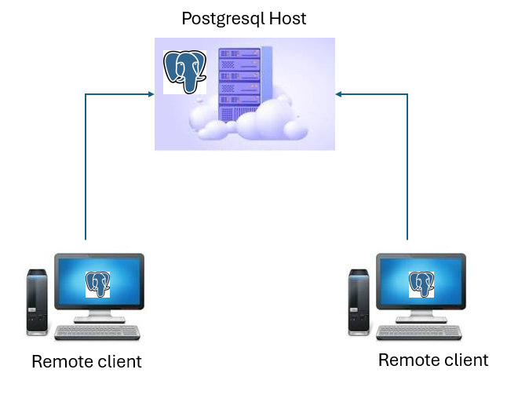
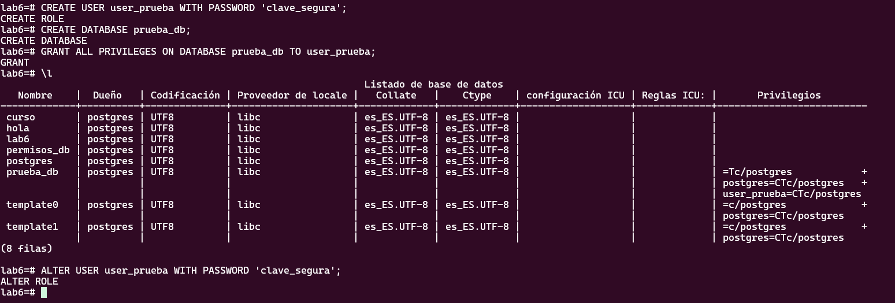
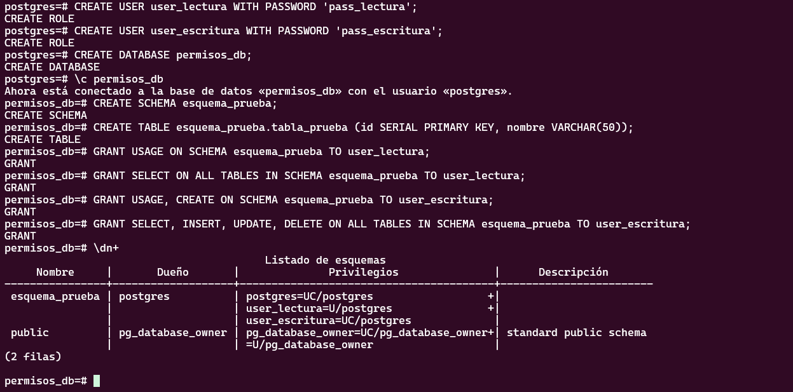

# Gestión de usuarios y autenticación, acceso remoto y permisos. 

## Objetivo de la práctica:
Al finalizar la práctica, serás capaz de:
- Aprender a crear usuarios, asignar contraseñas y gestionar la autenticación en PostgreSQL.
- Configurar PostgreSQL para permitir conexiones remotas y conectarse desde otra máquina.
- Aprender a gestionar permisos de usuarios en PostgreSQL a nivel de base de datos, esquema y tabla.

## Objetivo Visual 



## Duración aproximada:
- 30 minutos.

## Tabla de ayuda:

## Instrucciones 

### Tarea 1. Crear usuario y asignar privilegios.
Paso 1. Inicie sesión en PostgreSQL como superusuario
```shell
sudo -u postgres psql
```

Paso 2. Cree un nuevo usuario llamado 'usuario_prueba'
```shell
CREATE USER user_prueba WITH PASSWORD 'clave_segura';
```
Paso 3. Verifique que el usuario se haya creado correctamente
```shell
\du
```
Paso 4. Cree una nueva base de datos llamada 'prueba_db'
```shell
CREATE DATABASE prueba_db;
```
Paso 5. Otorgue todos los privilegios sobre la base de datos 'prueba_db' al usuario 'user_prueba':
```shell
GRANT ALL PRIVILEGES ON DATABASE prueba_db TO user_prueba;
```
Paso 6. Verifique que el usuario tenga todos los privilegios sobre la base de datos prueba_db.
```shell
\l
```
Paso 7. Cambiar la clave del usuario user_prueba por 'otra_clave'
```shell
ALTER USER user_prueba WITH PASSWORD 'clave_segura';
```


### Tarea 2. Configurar acceso remoto a la base de datos 'prueba_db' del usuario 'user_prueba' desde el host 'host_remoto'

Paso 1. Edite el archivo postgresql.conf y cambie la línea listen_address = 'localhost' por listen_address = '*':
```shell
sudo vi /etc/postgresql/[version]/main/postgresql.conf
```

Paso 2. Edite el archivo pg_hba.conf.
```shell
sudo vi /etc/postgresql/[version]/main/pg_hba.conf
```
Agrege la siguiente línea: 
```shell
host    prueba_db    user_prueba    host_remoto/32    md5
```
Paso 3. Reiniciar el servicio.

```shell
sudo service postgresql restart
```
Paso 4. Instalar la utilidad psql en la máquina remota con ip 'host_remoto'

```shell
sudo apt-get install postgresql-client
```
Paso 5. Intente conectarse remotamente.

```shell
[host_remoto]# psql -h <ip del servidor> -U user_prueba -d prueba_db
```

### Tarea 3. Crear usuarios con permisos específicos sobre recursos.

Paso 1. Abra una sesion de psql como administrador sobre la base de datos curso.
```shell
sudo psql curso
```

Paso 2. Cree dos nuevos usuarios.
```shell
CREATE USER user_lectura WITH PASSWORD 'pass_lectura';
CREATE USER user_escritura WITH PASSWORD 'pass_escritura';
```

Paso 3. Cree una nueva base de datos y conéctese a ella:
```shell
CREATE DATABASE permisos_db;
\c permisos_db
```

Paso 4. Cree un nuevo esquema y una tabla.
```shell
CREATE SCHEMA esquema_prueba;
CREATE TABLE esquema_prueba.tabla_prueba (id SERIAL PRIMARY KEY, nombre VARCHAR(50));
```

Paso 5. Otorgue permisos de lectura al user_lectura
```shell
GRANT USAGE ON SCHEMA esquema_prueba TO user_lectura;
GRANT SELECT ON ALL TABLES IN SCHEMA esquema_prueba TO user_lectura;
```

Paso 6. Otorgue permisos de escritura al user_escritura:
```shell
GRANT USAGE, CREATE ON SCHEMA esquema_prueba TO user_escritura;
GRANT SELECT, INSERT, UPDATE, DELETE ON ALL TABLES IN SCHEMA esquema_prueba TO user_escritura;
```
Paso 7. Revise los permisos asignados.
```shell
\dn+
```


### Resultado esperado

Tarea 1


Tarea 2
- Debe poder editar los archivos de configuración de PostgreSQL.
- Debe poder reiniciar el servicio de PostgreSQL sin errores.
- Debe poder conectarse a la base de datos desde una máquina remota usando la dirección IP del servidor.

Tarea 3



