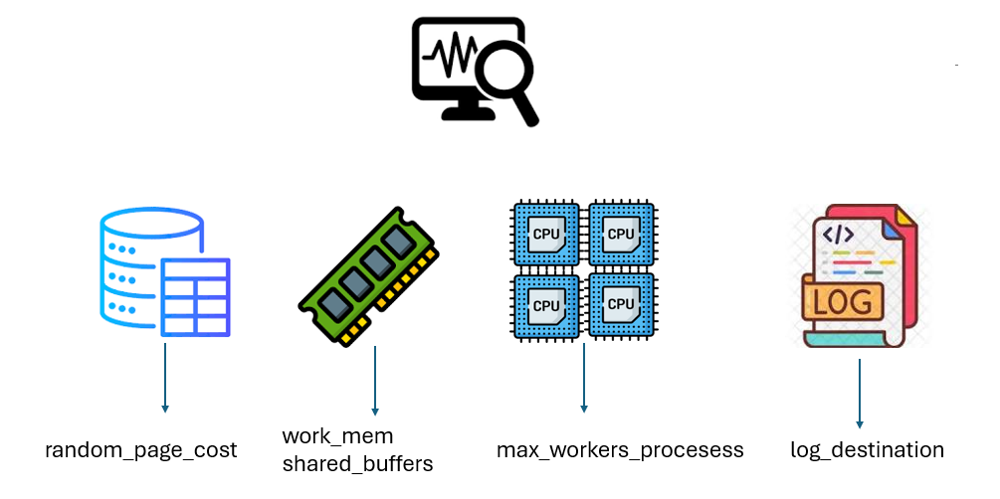
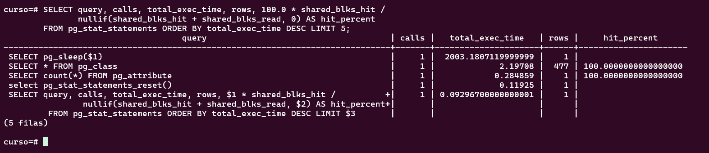

# Configuración y monitoreo de la base de datos

## Objetivo de la práctica:

Al finalizar la práctica, serás capaz de:

- Modificar parámetros de postgresql
- Configurar el sistema de logging de postgresql
- Monitorear los recursos utilizados por las consultas sql

## Objetivo Visual 



## Duración aproximada:

- 30 minutos.


## Instrucciones 

### Tarea 1. Modifique el archivo postgresql.conf para aumentar el número máximo de conexiones a 200.

Paso 1. Edite el archivo postgresql.conf.

```shell
sudo vi /etc/postgresql/[version instalada]/main/postgresql.conf
```

Paso 2. Buscar la línea que contiene 'max_connections' y modificarla.

```shell
max_connections = 200
```

Guardar cambios y salir.

Paso 3. Reiniciar el servicio postgresql.

```shell
sudo service postgresql restart
```

Paso 4. Verificar el nuevo valor de max_connections

```shell
psql -c "SHOW max_connections;"
```

### Resultado esperado


### Tarea 2. Configurar el logging para capturar consultas que tarden más de 1 segundo en ejecutarse

Paso 1. Edite el archivo postgresql.conf.

```shell
sudo vi /etc/postgresql/[version instalada]/main/postgresql.conf
```

Paso 2. Modificar o añadir la siguiente línea:

```shell
log_min_duration_statement = 1000  # log queries que requiren más de un segundo
```

Paso 3. Guardar los cambios y salir del editor

Paso 4. Reiniciar el servicio postgresql.

```shell
sudo service postgresql restart
```

Paso 5. Ejecutar una consulta lenta para probar

```shell
psql -c "SELECT pg_sleep(2); SELECT 'Consulta lenta';"
```

Paso 6. Verificar el log

```shell
sudo tail -n 20 /var/log/postgresql/postgresql-2024-09-19_120000.log
```

### Resultado esperado


### Tarea 3. Utilizar pg_stat_statements para identificar las consultas más costosas

Paso 1. Edite el archivo postgresql.conf.

```shell
sudo vi /etc/postgresql/[version instalada]/main/postgresql.conf
```

Modificar o agregar la siguiente línea:

```shell
shared_preload_libraries = 'pg_stat_statements'
```

Paso 2. Reiniciar el servicio postgresql.

```shell
sudo service postgresql restart
```

Paso 3. Crear la extension pg_stat_statements.

```shell
psql -d curso -c "CREATE EXTENSION pg_stat_statements;"
```

Paso 4. Ejecutar consultas de ejemplo.

```shell
psql -c "SELECT * FROM pg_stat_statements_reset();" # se usa para resetear el registro.
psql -c "SELECT * FROM pg_class;"
psql -c "SELECT pg_sleep(2); SELECT count(*) FROM pg_attribute;"
```

Paso 5. Consultar la vista pg_stat_statements.

```shell
psql -c "SELECT query, calls, total_exec_time, rows, 100.0 * shared_blks_hit /
               nullif(shared_blks_hit + shared_blks_read, 0) AS hit_percent
        FROM pg_stat_statements ORDER BY total_exec_time DESC LIMIT 5;"
```

### Resultado esperado:



## [Índice principal](../README.md)

## [Práctica 6. Gestión de usuarios y autenticación, acceso remoto y permisos](./Capítulo6/README.md)

## [Práctica 8. Actualización de la versión mayor de PostgreSQL o upgrade y estadísticas extendidas](./Capítulo8/README.md)
