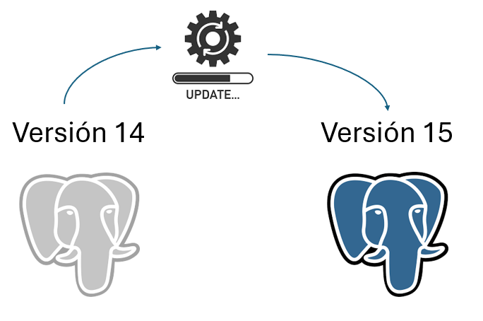
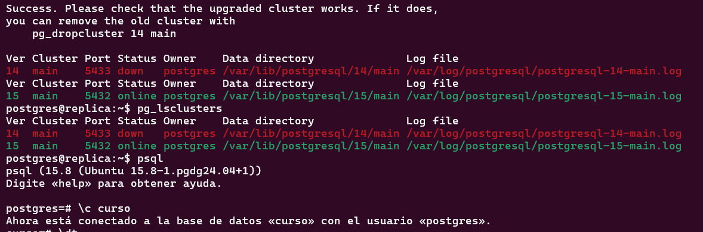

# Actualización de la versión mayor de Postgresql o upgrade

## Objetivo de la práctica:
Al finalizar la práctica, serás capaz de:
- Actualizar la versión mayor de Postgresql.
- Utilizar EXPLAIN (ANALYZE, BUFFERS) para análisis detallado y aplicar estadísticas extendidas.
- Objetivo3

## Objetivo Visual 
Crear un diagrama o imagen que resuma las actividades a realizar, un ejemplo es la siguiente imagen. 



## Duración aproximada:
- 60 minutos.

## Tabla de ayuda:

## Instrucciones

### Tarea 1. 
Paso 1. Realizar un respaldo del cluster.
```shell
pg_dumpall > backup_antes_upgrade.sql
```
Paso 2. Bajar el servicio.
```shell
sudo service postgresql stop
```

Paso 3. Instalar la versión 15 de postgresql. (la versión 14 se instaló en el laboratorio 1)
```shell
sudo apt-get install postgresql-15
```

Paso 4. Entrar como usuario postgres y eliminar el cluster main de la nueva versión.
```shell
pg_dropcluster 15 main --stop
```

Paso 5. Ejecutar el comando pg_upgradecluster
```shell
pg_upgradecluster 14 main
```
### Resultado esperado



### Tarea 2. Utilizar EXPLAIN (ANALYZE, BUFFERS) para análisis detallado y aplicar estadísticas extendidas.
Paso 1. Ejecutar EXPLAIN (ANALYZE, BUFFERS) en una consulta compleja.


Paso 2. <!-- Añadir instrucción -->

Paso 3. <!-- Añadir instrucción -->

### Resultado esperado
En esta sección, se debe mostrar el resultado esperado de nuestro laboratorio

