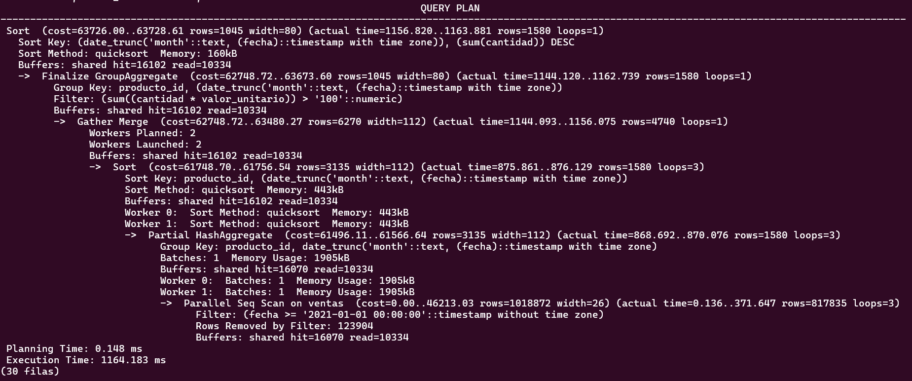

# Actualización de la versión mayor de Postgresql o upgrade y estadísticas extendidas.

## Objetivo de la práctica:

Al finalizar la práctica, serás capaz de:
- Actualizar la versión mayor de Postgresql.
- Utilizar EXPLAIN (ANALYZE, BUFFERS) para análisis detallado y aplicar estadísticas extendidas.

## Objetivo Visual 

Crear un diagrama o imagen que resuma las actividades a realizar, un ejemplo es la siguiente imagen. 


## Duración aproximada:

- 60 minutos.

## Instrucciones

### Tarea 1. 

Paso 1. Realizar un respaldo del cluster.

```shell
pg_dumpall > backup_antes_upgrade.sql
```

Paso 2. Bajar el servicio.

```shell
sudo service postgresql stop
```

Paso 3. Instalar la versión 15 de postgresql. (la versión 14 se instaló en el laboratorio 1)

```shell
sudo apt-get install postgresql-15
```

Paso 4. Entrar como usuario postgres y eliminar el cluster main de la nueva versión.

```shell
pg_dropcluster 15 main --stop
```

Paso 5. Ejecutar el comando pg_upgradecluster

```shell
pg_upgradecluster 14 main
```

### Resultado esperado


### Tarea 2. Utilizar EXPLAIN (ANALYZE, BUFFERS) para análisis detallado y aplicar estadísticas extendidas.

Paso 1. Ingresar a la base de datos curso y crear una tabla de pruebas a partir de la tabla facturas y facturas item.

```shell
psql curso
CREATE TABLE ventas AS SELECT * FROM facturas_item;
ALTER TABLE ventas ADD fecha date;
UPDATE ventas set fecha = (select fecha from facturas a where a.id = factura_id);
```

Paso 2. Insertar más datos ficticios de facturas para apreciar mejor las diferencias.

```shell
INSERT INTO ventas SELECT * FROM ventas; # x2 de los registros originales
INSERT INTO ventas SELECT * FROM ventas; # x4 de los registros originales
INSERT INTO ventas SELECT * FROM ventas; # x8 de los registros originales
INSERT INTO ventas SELECT * FROM ventas; # x16 de los registros originales
INSERT INTO ventas SELECT * FROM ventas; # x32 de los registros originales
INSERT INTO ventas SELECT * FROM ventas; # x64 de los registros originales
INSERT INTO ventas SELECT * FROM ventas; # x128 de los registros originales
INSERT INTO ventas SELECT * FROM ventas; # x256 de los registros originales
INSERT INTO ventas SELECT * FROM ventas; # x512 de los registros originales
INSERT INTO ventas SELECT * FROM ventas; # x1014 de los registros originales
```

Paso 3. Ejecutar EXPLAIN (ANALYZE, BUFFERS) en una consulta compleja.

```shell
EXPLAIN (ANALYZE, BUFFERS)
SELECT producto_id, DATE_TRUNC('month', fecha) as mes, 
       SUM(cantidad) as total_cantidad, 
       AVG(valor_unitario) as precio_promedio
FROM ventas 
WHERE fecha >= '2022-01-01'::date - interval '1 year'
GROUP BY producto_id, DATE_TRUNC('month', fecha)
HAVING SUM(cantidad * valor_unitario) > 100
ORDER BY mes, total_cantidad DESC;
```

Paso 4. Crear las estadísticas extendidas para la tabla ventas:

```shell
CREATE STATISTICS ext_stats_ventas (dependencies) ON  DATE_TRUNC('month',fecha), producto_id,valor_unitario, cantidad  FROM ventas;
ANALYZE ventas;
```

Paso 5. Ejecutar nuevamente la consulta y revisar los nuevos tiempos de ejecución.

```shell
EXPLAIN (ANALYZE, BUFFERS)
SELECT producto_id, DATE_TRUNC('month', fecha) as mes, 
       SUM(cantidad) as total_cantidad, 
       AVG(valor_unitario) as precio_promedio
FROM ventas 
WHERE fecha >= '2022-01-01'::date - interval '1 year'
GROUP BY producto_id, DATE_TRUNC('month', fecha)
HAVING SUM(cantidad * valor_unitario) > 100
ORDER BY mes, total_cantidad DESC;
```

### Resultado esperado

- Se espera una mejoría en el rendimiento.
  

